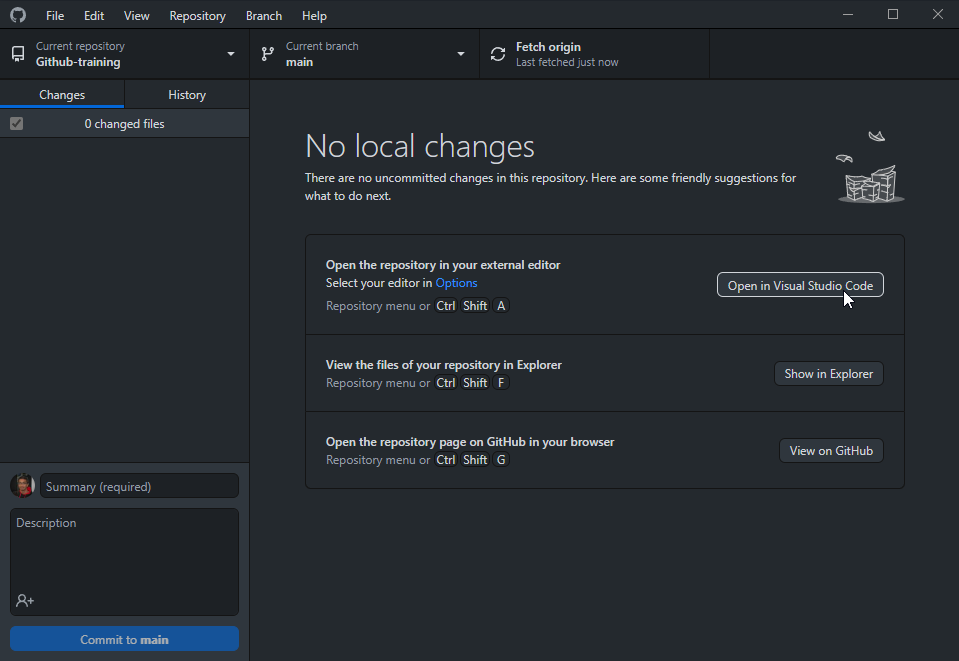
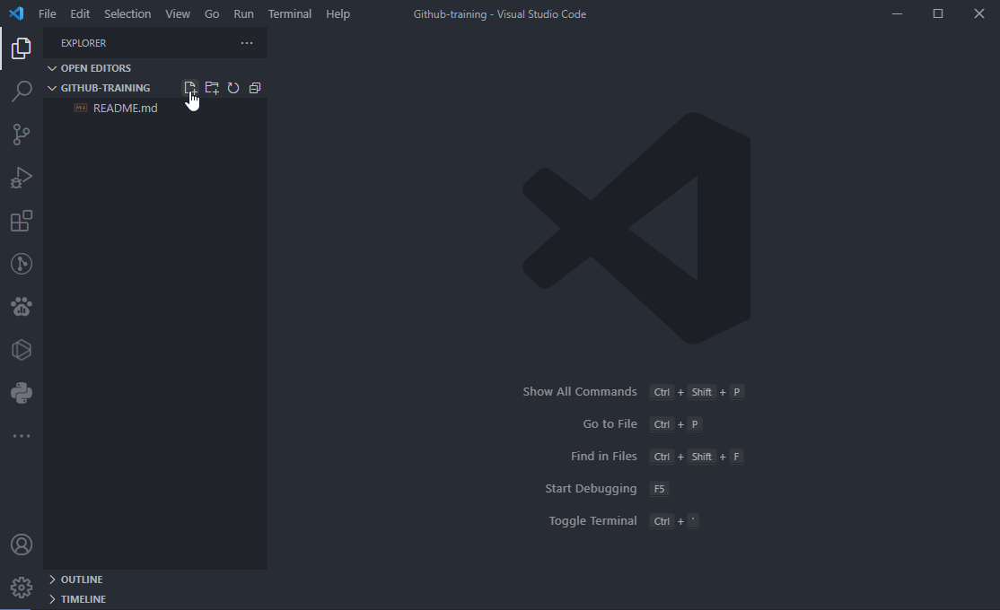
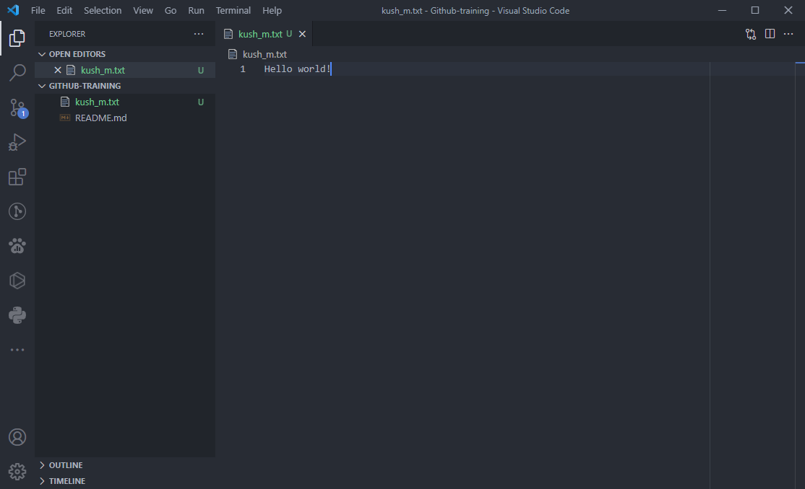
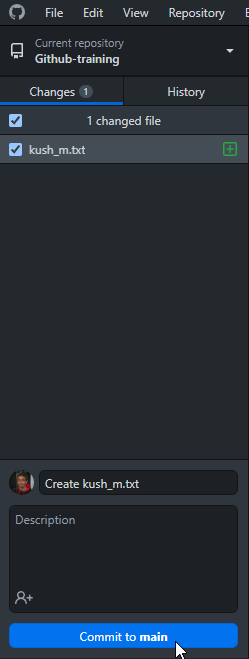
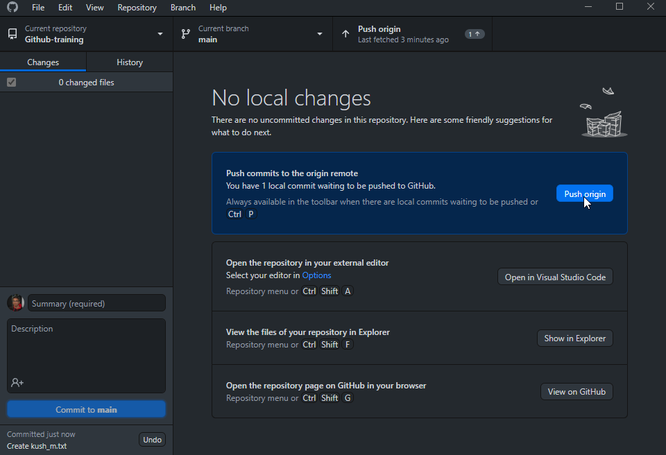

# GitHub Training Session Demo

Repository to aid a live demo of how to use Git and GitHub Desktop for the SunrIde Training Programme.

## Activity

This activity involves adding you creating a text file with your name as the file name and adding a fun message inside it.

You can do this by **cloning the repository**, **committing your changes**, **pushing and pulling any changes**!

Please refer to this [git cheat sheet](https://training.github.com/downloads/github-git-cheat-sheet.pdf) for help with commands.

 
Each step is explained below:

### 1. Install GitHub Desktop and Visual Studio Code

GitHub desktop is a GUI tool which can be used to manage Git repos easily.

It can be downloaded and installed from https://desktop.github.com/.

In order to edit the files, I recommend using [Visual Studio Code](https://code.visualstudio.com/), it's one of the most popular text editors available and can simplify your developer workflow a huge amount.

### 2. Clone the repository

Cloning a repo is creating a local version of the repository, this includes all of the commits and branches associated with the repo.

In GitHub Desktop, click "Clone a repository from the Internet" and then select the "URL" tab. Once shown a prompt for the repository URL, you can enter `https://github.com/TeamSunride/Github-training`. The local path option tells GitHub Desktop where to create the local repo.

### 3. Make your changes

The next step is to use VSCode to create a new file with a fun message inside.

You can open the repository in VSCode by clicking the "Open in Visual Studio Code" button.

Once VSCode is open, you can create a new file by clicking the "New File" button on the sidebar.

Enter your name as the file name (making sure to replace any spaces with underscores) and appending ".txt" to the file name, this will create a text file. You can then add a message inside the file.

Your file should now be highlighted in green in the side bar in VSCode, this indicates that the file is new and has not been pushed to the main repository yet (it only resides in your local repo until you push your change).

### 4. Create a pull request

The next step is to create push your change to the main repository.

Start by opening up GitHub Desktop again, once opened you should see your file name and file contents in green in the center of the window. Here you can see more information about your local repository, such as which branch you are currently working in, as well as when last time GitHub Desktop fetched from the main repository (checking for updates but not pulling them).

On the bottom left you can enter a message for the changes you made, as well as a description if desired. Once done, you can click "Commit to main".

This will package all of your changes into a commit which is now ready to be pushed to the main repository. This can be done simply by clicking "Push origin"

You have now created and pushed your commit to the main repository, congratulations!

### What now?

Refer to [these docs about GitHub Flow](https://docs.github.com/en/get-started/quickstart/github-flow), which is very
similar to what we just did, but with branches within a single repository

Try uploading one of your projects to GitHub using the things you learnt today.

Ask questions! Tag me (Tom#4831) or Yomi (Yomi#2706) on Discord and we'll gladly answer
